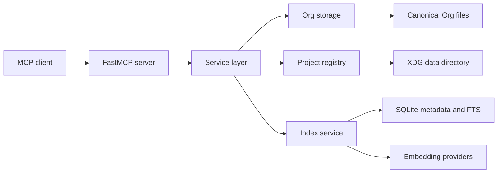

# Design Log #1: Org memory MCP

## Background

`org-mem` is a Python MCP server for durable agent memory. The current codebase has a single `main.py` file with a `FastMCP("org-mem")` instance and a sketch of the intended storage model.

The project will store long-lived memory as Org files so users can inspect, edit, sync, and version memory with normal Org and Git tools. SQLite will hold derived metadata, full-text search rows, and later embedding indexes.

External references checked during design:

- MCP stdio transport and local server configuration: https://modelcontextprotocol.io/specification/2025-06-18/basic/transports
- MCP local server setup: https://modelcontextprotocol.io/docs/develop/connect-local-servers
- Python MCP SDK and FastMCP: https://github.com/modelcontextprotocol/python-sdk
- uv project workflow: https://docs.astral.sh/uv/guides/projects/
- Python packaging layout guidance: https://packaging.python.org/en/latest/discussions/src-layout-vs-flat-layout/
- Org IDs and links: https://orgmode.org/manual/Handling-Links.html
- Hybrid search and RRF references: https://www.elastic.co/guide/en/elasticsearch/reference/current/rrf.html, https://docs.weaviate.io/weaviate/search/hybrid, https://docs.pinecone.io/guides/search/hybrid-search

## Problem

Agents need a memory substrate that survives context compaction, project moves, and repeated sessions. The memory store must support exact project facts such as file paths and symbols, natural-language lookup, revision-aware updates, and review workflows that keep a project overview current.

The first implementation must be useful before embeddings are complete. It should provide a complete file-backed memory system with strict validation, deterministic search freshness, and a small MCP surface.

## Questions and answers

| Question | Answer |
| --- | --- |
| What is canonical storage? | Org files are canonical. SQLite is a rebuildable index/cache. |
| How is a project identified? | `memory_project(root_path, name_hint=None)` creates or resolves a registry-backed stable project ID. |
| What identifies a memory? | Each memory has a globally unique Org `ID`; filenames are readable hints. |
| What schema is required? | Required metadata: `ID`, `PROJECT_ID`, `MEMORY_TYPE`, `STATUS`, `CREATED`, `UPDATED`, `REVISION`, `CREATED_BY`, title, filetags, and body. Optional metadata includes sources, symbols, external URLs, related IDs, and pinned state. |
| Which memory types exist? | `overview`, `architecture`, `decision`, `invariant`, `convention`, `problem`, `handoff`, `outcome`. |
| How do updates work? | Updates edit the existing Org file, increment `REVISION`, update `UPDATED`, and require `expected_revision`. |
| What search does v1 need? | Milestone 1 ships SQLite metadata and FTS. Milestone 2 adds embeddings and hybrid rank fusion. |
| Which embedding providers are planned? | A provider interface with a local default provider and an optional OpenAI-compatible remote provider. |
| Where do files live? | Canonical Org files live under `~/Documents/org/roam/agent-memory`. Registry, SQLite indexes, and provider cache live under XDG data paths. |
| What is the MCP surface? | `memory_project`, `memory_write`, `memory_read`, `memory_list`, `memory_search`, `memory_update`, `memory_link`, `memory_archive`, `memory_review`. |
| How do global memories work? | `global` is a reserved project ID using the same schema and tools. |
| How are conflicts handled? | Optimistic concurrency rejects stale updates and returns the current memory plus a conflict reason. |
| What body structure is required? | All memories have `Content`, `Sources`, and `Related memories` sections. Some types have conventional extra sections. |
| What evidence is required? | Agent-written non-overview memories require at least one evidence item. User-authored memories and overview memories may omit evidence. |
| How does archive work? | `memory_archive` sets `STATUS=archived`, updates timestamps, increments revision, and keeps the file. |
| What does `memory_review` do? | It stores caller-provided overview content in `projects/<project_id>/project.org` and records reviewed memory IDs/revisions. |
| How are links represented? | Links are typed with a closed vocabulary: `supports`, `supersedes`, `contradicts`, `depends_on`, `related_to`, `derived_from`, `fixes`, `mentions`. |
| How does indexing run? | Mutations enqueue an async project rebuild. `memory_search` waits for the project index to become fresh. |
| What runtime comes first? | Stdio FastMCP server. |
| Where does configuration live? | `~/.config/org-memory-mcp/config.toml`, with environment overrides for MCP client launches and tests. |
| What response shape do tools use? | Uniform `ok` envelopes with structured repairable errors. |
| What is logged? | Operational fields go to stderr or a rotating file. Memory bodies, source snippets, embedding inputs, and API keys are redacted. |

## Design

### Storage layout

Canonical memory files live under:

```text
~/Documents/org/roam/agent-memory/
  global/
    project.org
    overview/
    architecture/
    decisions/
    invariants/
    conventions/
    problems/
    handoffs/
    outcomes/
  projects/
    <project_id>/
      project.org
      overview/
      architecture/
      decisions/
      invariants/
      conventions/
      problems/
      handoffs/
      outcomes/
```

Memory filenames use:

```text
<created-date>-<slug>-<short-id>.org
```

The Org `ID` property is the stable identity. Moving or renaming a file must preserve the ID.

Server-managed state lives under:

```text
~/.local/share/org-memory-mcp/
  projects.json
  index.sqlite3
  embeddings/
```

Persistent configuration lives at:

```text
~/.config/org-memory-mcp/config.toml
```

Environment overrides:

```text
ORG_MEMORY_ROOT
ORG_MEMORY_DATA_DIR
ORG_MEMORY_EMBEDDING_PROVIDER
ORG_MEMORY_EMBEDDING_MODEL
ORG_MEMORY_OPENAI_BASE_URL
ORG_MEMORY_OPENAI_API_KEY
```

### Data model

Each memory file uses an Org property drawer plus Org body sections.

```org
:PROPERTIES:
:ID:              0197a8d4-52dc-71ec-a1cb-0f93eb217b38
:PROJECT_ID:      effspec-a91c3f
:MEMORY_TYPE:     decision
:STATUS:          active
:CREATED:         [2026-06-28 Sun 16:20]
:UPDATED:         [2026-06-28 Sun 16:20]
:REVISION:        1
:CREATED_BY:      agent
:END:
#+title: Preserve heap location during dereference use
#+filetags: :agent-memory:effspec:semantics:decision:

* Content

The memory body goes here.

* Sources

- File: =EffSpec/Pcc/Semantics.lean=
- Theorem: =path_use_preservation=

* Related memories

- [[id:4a8fd180-cab8-4aa8-bab4-f46a71949927][Path-use preservation]]
```

Type-specific conventional sections:

```text
decision: Context, Decision, Rationale, Consequences
problem: Symptoms, Diagnosis, Fix, Prevention
handoff: Current state, Verification, Next steps
outcome: Change, Evidence, Follow-up
```

### Project activation

`memory_project(root_path, name_hint=None)` is explicit and idempotent. It resolves the root path, creates or finds a project ID, writes the mapping to `projects.json`, ensures the project directory exists, and returns project metadata.

Project ID format:

```text
<readable-slug>-<short-hash>
```

The hash source is the Git remote URL when present, then absolute root path, then a generated UUID for paths without stable repository data.

### MCP tools

Tool signatures use JSON-compatible arguments and response envelopes.

```text
memory_project(root_path, name_hint=None)
memory_write(project_id|scope, memory_type, title, body, evidence, tags=None, links=None)
memory_read(memory_id|path, include_links=True)
memory_list(project_id|scope, memory_type=None, status="active", tags=None, sort="updated_desc", limit=50, cursor=None)
memory_search(project_id|scope, query, memory_type=None, status="active", tags=None, include_body=False, include_links=False, limit=20)
memory_update(memory_id, expected_revision, title=None, body=None, evidence=None, tags=None)
memory_link(source_id, target_id, relation, note=None, expected_revision=None)
memory_archive(memory_id, expected_revision, reason=None)
memory_review(project_id|scope, overview_body, reviewed_revisions, expected_revision=None)
```

Successful mutating response:

```json
{
  "ok": true,
  "memory_id": "0197a8d4-52dc-71ec-a1cb-0f93eb217b38",
  "project_id": "effspec-a91c3f",
  "revision": 4,
  "path": "projects/effspec-a91c3f/decisions/2026-06-28-preserve-heap-location-0197a8d4.org",
  "indexed": false,
  "index_generation": 12
}
```

Error response:

```json
{
  "ok": false,
  "error": {
    "code": "missing_required_section",
    "message": "Memory body is missing a required Org section.",
    "field": "body.sections",
    "hint": "Add a top-level '* Sources' section."
  }
}
```

### Indexing and search

Milestone 1 uses SQLite metadata tables and FTS. Mutating operations write the Org file first, enqueue the project ID in a single in-process dirty-project queue, and return. A background worker coalesces rebuild work by project.

`memory_search` calls `wait_until_index_fresh(project_id)` before querying SQLite. Search observes durable writes and fresh index state.

Default search result:

```json
{
  "memory_id": "0197a8d4-52dc-71ec-a1cb-0f93eb217b38",
  "project_id": "effspec-a91c3f",
  "title": "Preserve heap location during dereference use",
  "memory_type": "decision",
  "status": "active",
  "revision": 3,
  "score": 12.4,
  "matched_fields": ["title", "body"],
  "snippet": "Dereference-use keeps the heap and root pointer...",
  "path": "projects/effspec-a91c3f/decisions/2026-06-28-preserve-heap-location-0197a8d4.org"
}
```

Milestone 2 adds embedding provider implementations and hybrid retrieval. The search pipeline will apply metadata filters, run lexical and vector search, fuse rankings with Reciprocal Rank Fusion, and reserve reranking for a later milestone.

### Review workflow

`memory_review` updates:

```text
projects/<project_id>/project.org
```

The caller supplies the overview content. The server validates reviewed memory IDs and revisions, writes the overview, and records review metadata in the Org file. The language model performs synthesis; the server handles storage integrity.

### Validation rules

Writes and updates reject:

- Missing required metadata.
- Unknown `MEMORY_TYPE`, `STATUS`, or link relation.
- Missing required body sections.
- Missing evidence for agent-written non-overview memories.
- Duplicate IDs.
- Broken target links.
- Invalid `expected_revision`.
- Paths that escape the configured memory root.

Validation errors return field-specific codes and hints.

### Logging

The stdio server writes protocol traffic to stdout only. Logs go to stderr or a configured rotating file.

Logs include:

```text
tool name
project_id
memory_id
revision
duration
index_generation
error code
```

Logs redact memory bodies, source snippets, embedding input text, and API keys.

### Module boundaries

```text
org_mem/config.py       load config, environment overrides, defaults
org_mem/models.py       dataclasses, enums, result types
org_mem/org_file.py     Org parse and serialize
org_mem/registry.py     root-to-project registry
org_mem/storage.py      canonical file operations
org_mem/index.py        SQLite metadata, FTS, async rebuild worker
org_mem/embeddings.py   provider interface and implementations
org_mem/service.py      application use cases
org_mem/server.py       FastMCP tool registration
main.py                 entrypoint
```

Each module needs a module docstring that states its boundary and primary responsibility.



## Implementation plan

### Phase 1: project structure and baseline tests

Create the `org_mem/` package, move the FastMCP setup into `org_mem/server.py`, keep `main.py` as a tiny entrypoint, and add the test framework. Add module docstrings for every new module.

Tests:

- import smoke test
- server construction test
- config default/env override test

### Phase 2: models, Org parser, and validation

Implement memory type/status/link enums, dataclasses, Org serialization, Org parsing, and validation.

Tests:

- valid memory round trip
- required metadata checks
- required section checks
- evidence rule checks
- invalid type/status/relation checks

### Phase 3: registry and file storage

Implement `memory_project`, path layout, safe file writes, reads, updates, archive, and revision conflicts.

Tests:

- stable project ID creation
- registry persistence
- filename generation
- read after write
- update increments revision
- stale `expected_revision` rejection
- archive status transition

### Phase 4: SQLite metadata and FTS index

Implement schema creation, project rebuild, FTS indexing, async dirty-project queue, and search freshness waits.

Tests:

- write enqueues rebuild
- search waits for fresh index
- metadata filters
- archived memories excluded by default
- deterministic list sorting and cursor pagination

### Phase 5: MCP tool registration

Register all milestone 1 tools through FastMCP and return uniform response envelopes.

Tests:

- tool registration
- representative tool calls
- validation error response shape
- stdio-safe logging path

### Phase 6: review workflow

Implement `memory_review` for `project.org`, including reviewed memory IDs and revisions.

Tests:

- project overview write
- invalid reviewed revision rejection
- repeated review update increments project overview revision

### Phase 7: milestone 2 retrieval

Add embedding provider interface, local default provider, optional OpenAI-compatible provider, vector storage, and hybrid rank fusion.

Tests:

- provider interface contract
- local provider indexing
- remote provider configuration validation
- hybrid fusion ordering

## Examples

Good memory write input:

```json
{
  "project_id": "effspec-a91c3f",
  "memory_type": "decision",
  "title": "Preserve heap location during dereference use",
  "body": "* Content\nDereference-use keeps pointer identity stable.\n\n* Sources\n- File: =EffSpec/Pcc/Semantics.lean=\n- Theorem: =path_use_preservation=\n\n* Related memories\n",
  "evidence": [
    {
      "kind": "symbol",
      "value": "path_use_preservation"
    }
  ],
  "tags": ["effspec", "semantics"]
}
```

Bad memory write input:

```json
{
  "project_id": "effspec-a91c3f",
  "memory_type": "misc",
  "title": "Stuff",
  "body": "Remember this",
  "evidence": []
}
```

Expected rejection:

```json
{
  "ok": false,
  "error": {
    "code": "invalid_memory_type",
    "field": "memory_type",
    "hint": "Use one of: overview, architecture, decision, invariant, convention, problem, handoff, outcome."
  }
}
```

Good review input:

```json
{
  "project_id": "effspec-a91c3f",
  "overview_body": "* Project map\n\nThis project contains EffSpec preservation proof notes.\n\n* Active decisions\n\n- Dereference-use preserves heap location.\n",
  "reviewed_revisions": [
    {
      "memory_id": "0197a8d4-52dc-71ec-a1cb-0f93eb217b38",
      "revision": 3
    }
  ]
}
```

## Trade-offs

Org-first storage gives readable files, Git-friendly diffs, and Emacs/Org-roam compatibility. It makes parsing and validation more complex than a database-only design.

SQLite as a cache gives fast listing and FTS while preserving a clear rebuild path. The index worker adds concurrency rules, but it keeps writes responsive and lets search block at the point where freshness matters.

A closed vocabulary improves validation and search filters. New concepts must map to existing types until the vocabulary grows through a design change.

Optimistic concurrency makes conflicts explicit and easy to test. Callers must carry `revision` values when updating.

Milestone 1 stops at FTS so the server can ship a complete file-backed system first. Milestone 2 adds embeddings and hybrid search after storage and indexing behavior is stable.

## Implementation results

Design phase completed on 2026-06-28. Implementation results will be appended phase by phase.

Skeleton phase completed on 2026-06-28. Added documented module skeletons, TODO function bodies with implementation hints, and a behavior-focused pytest suite covering config, models, Org parsing, registry, storage, indexing, embeddings, service, server wiring, logging, and review workflow. Verification command: `uv run pytest -q`. Current expected result: 36 failed, 4 passed, with failures caused by `NotImplementedError` TODO bodies.

Review-fix phase completed on 2026-06-28. Fixed stdio entrypoint delegation, package script metadata, unique memory filenames, required `CREATED`/`UPDATED` Org metadata, body/evidence/tag update handling, uniform server validation envelopes, stable `project.org` identity across reviews, index rebuild error reporting for malformed Org files, and FastEmbed-backed local embeddings. Added regression tests for those cases. Verification command: `uv run pytest -q`. Current result: 47 passed.

Concurrency hardening completed on 2026-06-28. Added `org_mem/locking.py` with a shared POSIX advisory lock at `config.data_dir / "org-mem.lock"` and an atomic text writer based on same-directory temp files plus `os.replace`. `MemoryStorage` now serializes full read/check/write critical sections for memory write, read, update, link, archive, and review overview writes. `ProjectRegistry` now serializes registry load/modify/save and scaffold creation. `MemoryIndex` now serializes schema creation and project rebuilds, uses a 30 second SQLite busy timeout, records project Org-tree snapshots, and rebuilds before search when another server instance has changed canonical Org files. Added multiprocessing regression tests for lock blocking, storage/registry lock participation, atomic replacement failure behavior, and cross-instance search freshness. Verification command: `uv run pytest -q`. Current result: 53 passed.
