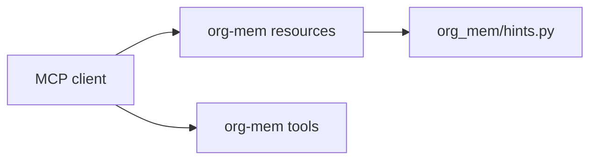

# Design Log #2: MCP-native resource hints

## Background

`org-mem` exposes MCP tools for durable Org-backed project memory. Agents need compact guidance on when to search, write, update, link, archive, and review memories. The user chose MCP resources as the first native hint mechanism.

External references checked during design:

- MCP resources: https://modelcontextprotocol.io/specification/2025-06-18/server/resources
- MCP tools: https://modelcontextprotocol.io/specification/2025-06-18/server/tools
- MCP prompts: https://modelcontextprotocol.io/specification/2025-06-18/server/prompts
- FastMCP Python SDK resource decorator docs through Context7 for `/modelcontextprotocol/python-sdk`

## Problem

Instructions copied into every agent profile drift. The server should publish a small, stable guide through MCP resources so clients can discover how to use the memory tools directly from the server.

## Questions and answers

| Question | Answer |
| --- | --- |
| Which MCP hint primitive comes first? | Resources only. |
| Which resource URIs are needed? | `org-mem://guide`, `org-mem://schema`, and `org-mem://workflow`. |
| Should prompts or helper tools be added now? | The approved scope is resources. |
| Where does hint text live? | A documented `org_mem/hints.py` module so server wiring stays thin. |
| How should tests inspect resources? | Use FastMCP's resource listing and read APIs, matching current SDK behavior. |

## Design

Add static text resources:

```text
org-mem://guide      agent operating guide
org-mem://schema     memory types, sections, evidence, revision rules
org-mem://workflow   start/search/write/update/review workflow
```

Each resource returns concise Markdown. The content should name concrete tools and required arguments, including `memory_project`, `memory_search`, `memory_write`, `memory_update`, `memory_link`, `memory_archive`, and `memory_review`.

Module boundary:

```text
org_mem/hints.py    static MCP resource text and URI/content lookup helpers
org_mem/server.py   FastMCP resource registration
```



## Implementation plan

1. Add tests that assert the three resource URIs are registered.
2. Add tests that read each resource and check for the core tool names and workflow rules.
3. Add `org_mem/hints.py` with constants and lookup helpers.
4. Register resources in `org_mem/server.py` with `@server.resource(...)`.
5. Run focused server tests, full pytest, compile, stdio smoke checks, and `jj status`.

## Examples

Good resource usage:

```text
Read org-mem://workflow before starting a repo task.
Call memory_project(root_path) before searching or writing.
Use memory_update(memory_id, expected_revision, ...) for existing records.
```

Good schema hint:

```text
Agent-written non-overview memories need evidence with concrete files, symbols, commands, links, or user decisions.
```

## Trade-offs

Resources are simple, discoverable context and do not add another mutating surface. Clients that expose resources poorly may need a later `memory_help` tool, but the current approved scope keeps the server contract small.

## Implementation results

Resource-only implementation completed on 2026-06-28. Added `org_mem/hints.py` with static guide, schema, and workflow text. Registered `org-mem://guide`, `org-mem://schema`, and `org-mem://workflow` in `org_mem/server.py` using FastMCP resource decorators. Added server tests that list resource URIs and read resource content through FastMCP's async resource APIs. Focused verification command: `uv run pytest tests/test_server.py::test_create_server_registers_resource_hints tests/test_server.py::test_resource_hints_describe_memory_tool_usage -q`. Current focused result: 2 passed.
