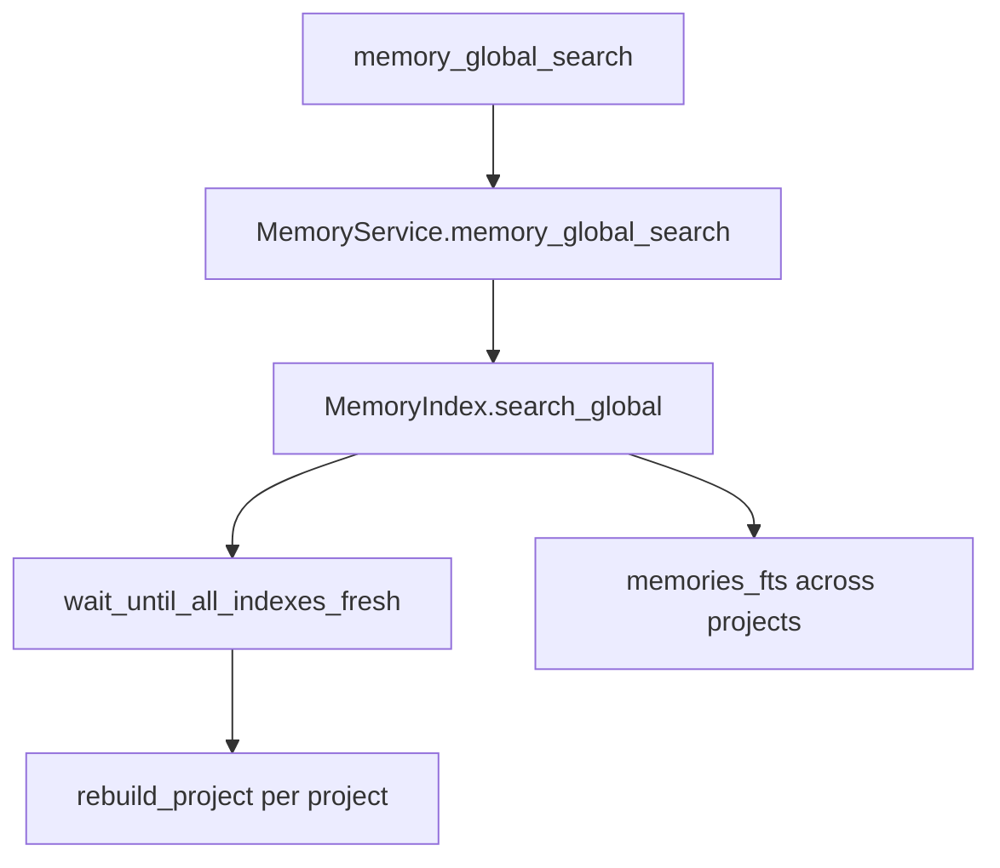

# Design Log #3: Global memory search

## Background

`org-mem` currently searches memories inside one project through `memory_search(project_id, query, ...)`. Agents also need to reuse durable lessons, workflows, and design decisions from other projects.

## Problem

Project-local search is the right default for ordinary implementation work. Reusable memories need an explicit cross-project query so agents can discover prior patterns while preserving source provenance.

## Questions and Answers

| Question | Answer |
| --- | --- |
| What is the first MCP surface? | Add `memory_global_search(query, ...)`. |
| How should provenance be returned? | Each result already includes `project_id`, `memory_id`, `memory_type`, `status`, `revision`, `path`, and snippet. |
| How should freshness work? | Before global search, rebuild all dirty projects and any project tree whose Org snapshot changed. |
| What filters are supported first? | `memory_type`, `status`, `tags`, and `limit`, matching `memory_search`. |

## Design



`memory_search` remains scoped by `project_id`. `memory_global_search` queries the same FTS index across all indexed projects after forcing global freshness.

## Implementation Plan

1. Add failing tests for global search in index, service, server, and hints.
2. Add an index freshness helper for all project directories.
3. Add a global FTS query path without the `m.project_id = ?` predicate.
4. Add `MemoryService.memory_global_search`.
5. Register `memory_global_search` as an MCP tool.
6. Update resource hints to teach when to use global search.
7. Run focused and full verification.

## Examples

Good pattern:

```python
service.memory_global_search(query="wayland clipboard recovery", tags=["workflow"])
```

Result items carry source project identity:

```json
{
  "project_id": "klipper-recovery-123abc",
  "memory_id": "...",
  "title": "Klipper SQLite recovery workflow"
}
```

## Trade-offs

Global freshness can scan every project directory. This is acceptable for the first version because Org files are canonical and correctness matters more than global query latency.

## Implementation Results

Implemented on 2026-06-28. Added `MemoryIndex.search_global` with a shared `_search_rows` path for local and global FTS queries. Added `wait_until_all_indexes_fresh` so global search rebuilds dirty projects, changed project trees, and indexed projects whose canonical directory was removed. Added `MemoryService.memory_global_search`, registered the `memory_global_search` MCP tool, and updated resource hints to name the cross-project workflow.

Focused verification: `uv run pytest tests/test_index.py::test_global_search_returns_hits_across_projects_with_provenance tests/test_index.py::test_global_search_rebuilds_changed_project_trees tests/test_service.py::test_service_global_search_returns_cross_project_results tests/test_server.py::test_create_server_registers_v1_tools tests/test_server.py::test_resource_hints_describe_memory_tool_usage -q`. Result: 5 passed.
