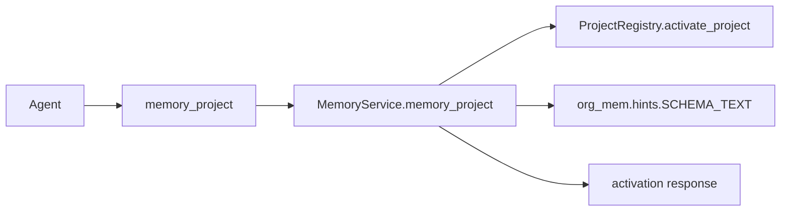

# Design Log #4: Project activation schema hint

## Background

`org-mem` publishes three MCP resources for agent guidance: `org-mem://guide`, `org-mem://schema`, and `org-mem://workflow`. Design Log #2 established `org_mem/hints.py` as the canonical home for this text, and current agents still miss memory type and content requirements because resource discovery depends on the client surfacing resources clearly.

External references checked during design:

- MCP resources: https://modelcontextprotocol.io/specification/2025-06-18/server/resources
- MCP tools: https://modelcontextprotocol.io/specification/2025-06-18/server/tools
- FastMCP Python SDK docs through Context7 for `/modelcontextprotocol/python-sdk`

## Problem

Agents start repository work with `memory_project(root_path, name_hint=None)`. The activation response currently returns project identity and paths:

```python
def memory_project(self, root_path: str, name_hint: str | None = None) -> dict[str, Any]
```

That leaves schema guidance one extra resource read away at the moment when agents choose memory types and write bodies.

## Questions and Answers

| Question | Answer |
| --- | --- |
| Which surface should print the schema text? | `MemoryService.memory_project(...)`, because every MCP `memory_project` call already passes through it. |
| Which schema text should activation return? | The existing `SCHEMA_TEXT` from `org_mem/hints.py`. |
| Which fields should be added? | `schema_uri: str` and `schema_text: str`. |
| How is backward compatibility preserved? | Existing `ok`, `project_id`, `root_path`, and `project_dir` fields stay unchanged. |
| How should tests prove the behavior? | Service and server tests call `memory_project` and assert the returned schema text names memory types, required sections, and evidence rules. |

## Design

Return the schema resource text directly in the project activation response while keeping `org-mem://schema` as the canonical resource.



Activation payload shape:

```json
{
  "ok": true,
  "project_id": "org-mem-eaf26e",
  "root_path": "/repo/root",
  "project_dir": "/memory/projects/org-mem-eaf26e",
  "schema_uri": "org-mem://schema",
  "schema_text": "# org-mem Schema Guide\n..."
}
```

Module boundaries:

```text
org_mem/hints.py      owns SCHEMA_URI and SCHEMA_TEXT
org_mem/service.py    adds schema_uri and schema_text to activation payload
org_mem/server.py     keeps the memory_project tool as a thin service call
```

## Implementation Plan

1. Add a failing service test in `tests/test_service.py` for `MemoryService.memory_project(...)` returning `schema_uri` and `schema_text`.
2. Add a failing server test in `tests/test_server.py` for the MCP `memory_project` tool returning the same schema content.
3. Import `SCHEMA_URI` and `SCHEMA_TEXT` in `org_mem/service.py`.
4. Add `schema_uri=SCHEMA_URI` and `schema_text=SCHEMA_TEXT` to the `ToolResponse.ok(...)` payload in `MemoryService.memory_project`.
5. Run focused tests, full pytest, compile, stdio smoke checks, and `jj status`.
6. Append implementation results here with exact verification output and deviations.

## Examples

✅ Good activation response usage:

```python
response = service.memory_project(str(repo_root))
schema = response["schema_text"]
```

✅ Good agent behavior after activation:

```text
Use memory_type="decision" for a durable design choice.
Include top-level Content, Sources, and Related memories sections.
Include evidence for agent-written non-overview memories.
```

❌ Bad memory type:

```json
{"memory_type": "design"}
```

❌ Bad memory body:

```text
Implemented the activation schema hint.
```

## Trade-offs

The activation response becomes larger by one compact Markdown schema block. The benefit is immediate guidance at the highest-leverage point in the workflow. Keeping `SCHEMA_TEXT` as the canonical text source keeps resources and activation payloads aligned.

## Implementation Results

Implemented on 2026-06-30. Added service-level coverage in `tests/test_service.py` and MCP tool-level coverage in `tests/test_server.py`. Both tests assert that project activation returns `schema_uri == SCHEMA_URI`, `schema_text == SCHEMA_TEXT`, and schema content covering memory types, required sections, and evidence requirements.

`MemoryService.memory_project(...)` now imports `SCHEMA_URI` and `SCHEMA_TEXT` from `org_mem.hints` and includes them in the activation `ToolResponse.ok(...)` payload. The server tool remains a thin service call.

Red-green verification:

```text
uv run pytest tests/test_service.py::test_service_project_activation_returns_schema_guidance tests/test_server.py::test_server_project_activation_returns_schema_guidance -q
FF [100%]
2 failed with KeyError: 'schema_uri'

uv run pytest tests/test_service.py::test_service_project_activation_returns_schema_guidance tests/test_server.py::test_server_project_activation_returns_schema_guidance -q
.. [100%]
2 passed in 1.09s
```

Full verification:

```text
uv run pytest -q
60 passed in 2.22s

uv run python -m compileall main.py org_mem tests
Listing 'org_mem'...
Listing 'tests'...
Compiling 'tests/test_server.py'...
Compiling 'tests/test_service.py'...

timeout 10s uv run python main.py </dev/null
exit 0

timeout 10s uv run org-mem </dev/null
exit 0
```

Deviation summary: implementation matches the approved design.
