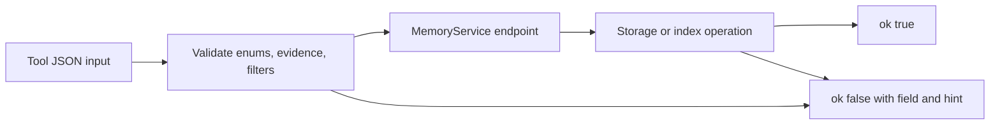

# Design Log #5: Strict evidence feedback

## Background

`memory_write` and `memory_update` accept `evidence` as a list of `{"kind": str, "value": str}` objects. Agents were making mistakes with memory types and evidence content requirements. Project activation now returns schema guidance, so endpoint errors should give exact repair reasons when the caller still sends invalid input.

External references checked during design:

- JSON Schema objects: https://json-schema.org/understanding-json-schema/reference/object
- MCP tools error handling: https://modelcontextprotocol.io/specification/draft/server/tools

## Problem

The previous evidence relaxation accepted arbitrary JSON objects when `kind` and `value` were present. That made invalid evidence harder to catch early and weakened the schema text. The current requirement is stricter: evidence items use exactly `kind` and `value`, and tool responses explain missing fields, extra fields, invalid enum values, stale revisions, missing IDs, malformed review inputs, and index rebuild failures.

## Questions and Answers

| Question | Answer |
| --- | --- |
| Which evidence inputs should be accepted? | JSON objects with exactly string keys `kind` and `value`. |
| How should extra evidence metadata be handled? | Return `invalid_evidence` with the unsupported field names. |
| How should missing evidence fields be handled? | Return `invalid_evidence` with the missing field name and the evidence schema hint. |
| Which endpoints need repairable feedback? | All service endpoints: project, write, read, list, search, global search, update, link, archive, and review. |
| How should endpoint errors be shaped? | Return `{"ok": false, "error": {"code", "message", "field", "hint"}}`. |

## Design



`Evidence` remains a strict value object:

```python
@dataclass(frozen=True, slots=True)
class Evidence:
    """Source evidence for an agent-written memory."""

    kind: str
    value: str
```

Accepted examples:

```json
{"kind": "file", "value": "org_mem/service.py"}
{"kind": "command", "value": "uv run pytest -q"}
```

Rejected examples:

```json
{"kind": "file", "path": "org_mem/service.py"}
{"kind": "file", "value": "org_mem/service.py", "line": 40}
```

Expected error messages:

- `invalid_evidence: evidence[0] missing required field: value`
- `invalid_evidence: evidence[0] has unsupported field(s): line`
- `invalid_memory_type: 'bogus'`
- `revision_conflict: expected 2, got 1`
- `index_rebuild_failed: <path>/bad.org: 'bogus' is not a valid MemoryType`

## Implementation Plan

1. Add failing tests for strict `Evidence` construction and extra evidence field rejection.
2. Add failing tests for service endpoint errors: missing IDs, stale revisions, invalid filters, rebuild failures, and malformed reviewed revisions.
3. Restore `Evidence(kind: str, value: str)` in `org_mem/models.py`.
4. Add shared evidence coercion that reports item indexes and exact missing or unsupported fields.
5. Update `org_mem/server.py` conversion paths and enum hints.
6. Add service-level validation and exception mapping in `org_mem/service.py`.
7. Update schema text in `org_mem/hints.py`.
8. Run focused red-green tests, full pytest, compileall, stdio smoke checks, and `jj status`.

## Trade-offs

The strict shape keeps the MCP schema simple and pushes richer metadata into the readable `value` string. The cost is less structured evidence at call time. The benefit is clearer agent repair behavior and stable Org `Sources` rendering.

## Implementation Results

Implemented on 2026-07-01. `Evidence` is strict again with only `kind` and `value` string fields. JSON evidence input is validated through `coerce_evidence_items(...)`, which reports item indexes and exact missing, unsupported, or wrong-type fields. Direct internal `Evidence(...)` construction also validates runtime field types.

`MemoryService` now validates filters and maps expected failures across all public endpoints into `ToolResponse.error(...)` envelopes with useful `field` and `hint` values. `memory_read`, `memory_update`, `memory_link`, and `memory_archive` map missing IDs to `not_found`. Search endpoints map malformed canonical Org files to `index_rebuild_failed`. `memory_review` validates `reviewed_revisions` before storage writes.

Red-green verification:

```text
uv run pytest tests/test_models.py::test_evidence_uses_exact_kind_value_fields tests/test_server.py::test_server_memory_write_rejects_extra_evidence_fields tests/test_server.py::test_server_memory_write_reports_invalid_evidence_reason tests/test_server.py::test_server_memory_update_reports_invalid_evidence_reason tests/test_service.py::test_service_read_missing_memory_returns_useful_error tests/test_service.py::test_service_update_reports_revision_conflict tests/test_service.py::test_service_update_missing_memory_returns_useful_error tests/test_service.py::test_service_list_invalid_filter_returns_useful_error tests/test_service.py::test_service_search_invalid_status_returns_useful_error tests/test_service.py::test_service_global_search_reports_index_rebuild_error tests/test_service.py::test_service_link_missing_memory_returns_useful_error tests/test_service.py::test_service_archive_missing_memory_returns_useful_error tests/test_service.py::test_service_review_reports_malformed_reviewed_revision tests/test_storage.py::test_update_memory_rejects_extra_evidence_fields -q
13 failed, 1 passed

uv run pytest tests/test_models.py::test_evidence_uses_exact_kind_value_fields tests/test_server.py::test_server_memory_write_rejects_extra_evidence_fields tests/test_server.py::test_server_memory_write_reports_invalid_evidence_reason tests/test_server.py::test_server_memory_update_reports_invalid_evidence_reason tests/test_service.py::test_service_read_missing_memory_returns_useful_error tests/test_service.py::test_service_update_reports_revision_conflict tests/test_service.py::test_service_update_missing_memory_returns_useful_error tests/test_service.py::test_service_list_invalid_filter_returns_useful_error tests/test_service.py::test_service_search_invalid_status_returns_useful_error tests/test_service.py::test_service_global_search_reports_index_rebuild_error tests/test_service.py::test_service_link_missing_memory_returns_useful_error tests/test_service.py::test_service_archive_missing_memory_returns_useful_error tests/test_service.py::test_service_review_reports_malformed_reviewed_revision tests/test_storage.py::test_update_memory_rejects_extra_evidence_fields -q
14 passed in 1.17s

uv run pytest tests/test_models.py::test_evidence_rejects_non_string_fields -q
1 failed before runtime field validation

uv run pytest tests/test_models.py::test_evidence_uses_exact_kind_value_fields tests/test_models.py::test_evidence_rejects_non_string_fields -q
2 passed in 0.04s
```

Full verification:

```text
uv run pytest -q
75 passed in 1.89s

uv run python -m compileall main.py org_mem tests
Listing 'org_mem'...
Listing 'tests'...
Compiling 'tests/test_models.py'...
Compiling 'tests/test_server.py'...
Compiling 'tests/test_service.py'...
Compiling 'tests/test_storage.py'...

timeout 10s uv run python main.py </dev/null
exit 0

timeout 10s uv run org-mem </dev/null
exit 0
```
